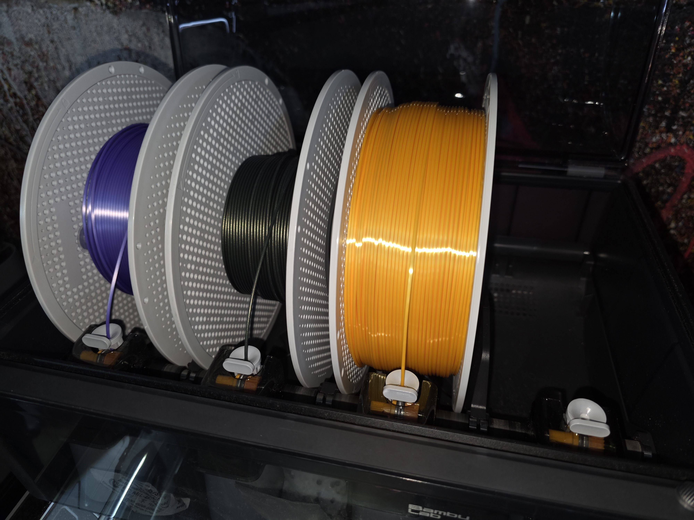
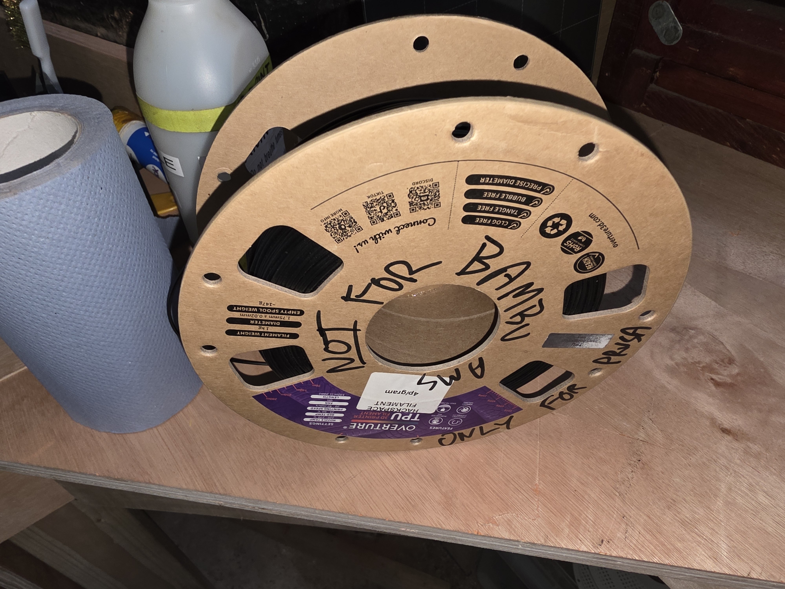
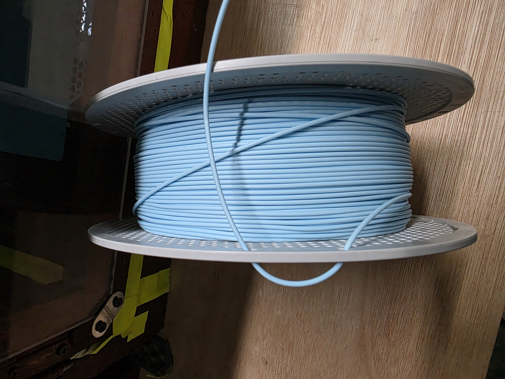

# Using the AMS 2 Pro

The Automatic Material System feeds filament to HacMan's Bambu printers.

<figure markdown="1">
  
  <figcaption>The AMS 2 Pro feeds filament to the Bambu printers. Spools must sit correctly and rotate freely.</figcaption>
</figure>

## Before use

- Confirm the intended spool and material.
- Check that the spool fits and rotates freely.
- Cut a damaged filament end cleanly.
- Close the lid fully.
- Confirm the material and colour shown in Bambu Studio.
- Bambu RFID spools can populate material details automatically. Other brands need manual material and colour setup.

## Loading filament

1. Open the AMS lid.
2. Place the spool in an empty slot so that it can rotate freely, with the filament feeding over the top of the spool towards the inlet.
3. Cut the filament end cleanly.
4. Gently push the grey feeder tab at the front of the slot.
5. Feed the filament into that slot's inlet until the AMS detects it and starts loading.
6. Stop pushing once the AMS motor has gripped the filament.
7. Confirm the material and colour shown on the printer or in Bambu Studio before printing.
8. Bambu RFID spools can populate this automatically. If using another brand, set or check the slot information manually rather than assuming the previous material and colour are still correct.
9. Close the AMS lid before starting the print.

## Spool rules

Bare cardboard spools must not be used directly in an AMS. Transfer the filament to a suitable plastic spool or fit approved adapter rings.

TPU must only be used in the AMS if it is specifically marked as suitable for AMS use. Standard flexible TPU should be printed without the AMS to avoid feed problems and clogs.

AMS compatibility is not the same as nozzle compatibility. Flexible, absorbent, brittle, very stiff, rough or fibre-filled filaments can cause AMS feeding problems even if the printer nozzle can print them. If the spool or filament does not feed smoothly, stop and use the rear spool holder or ask for help.

Do not force oversized, warped, damaged or poorly-wound spools into the AMS. The spool must fit cleanly, sit flat and rotate freely.

Metal-filled filament is prohibited on HacMan printers.

<figure markdown="1">
  
  <figcaption>Do not use bare cardboard spools in the AMS. Flexible TPU should only be used in the AMS if specifically marked as AMS-compatible.</figcaption>
</figure>

## Unloading filament

Use the unload function on the printer or in Bambu Studio and allow the AMS to retract the filament from the printer back to the AMS.

Once the filament has unloaded:

1. Press the feeder tab for that slot.
2. Remove the filament by hand.
3. If there is resistance, do not force it. Ask for help.
4. Remove the spool.
5. Secure the free end in the spool holes or retaining clip immediately.
6. Return Hackspace filament to storage, or take personal filament home or put it in your personal storage area if you have one.

The manufacturer guide notes that the AMS rollers can sometimes remain engaged after an error or power interruption. If the filament does not come out smoothly, stop rather than pulling hard.

<figure markdown="1">
  
  <figcaption>Secure the free end immediately after unloading filament to prevent tangles.</figcaption>
</figure>

Reference: [Bambu Lab - Setup and Filament Loading for the AMS](https://wiki.bambulab.com/x1/manual/ams-setup-and-filament-loading).
Reference: [Bambu Lab - Notes on the AMS](https://wiki.bambulab.com/en/knowledge-sharing/notes-AMS).

## Errors

If the AMS reports a jam, feeding error or motor problem:

1. Stop the job if necessary.
2. Read the displayed message.
3. Check only that the spool can rotate and that there is no obvious external obstruction.
4. Ask for help if the error remains.

Do not dismantle the AMS or force filament through it.
