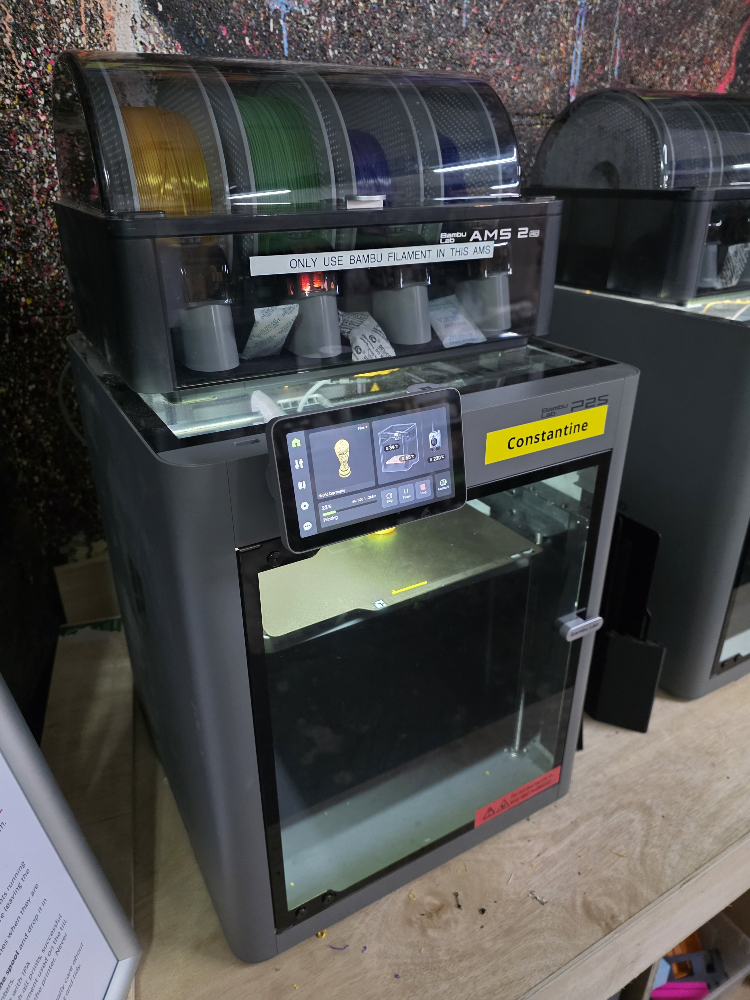
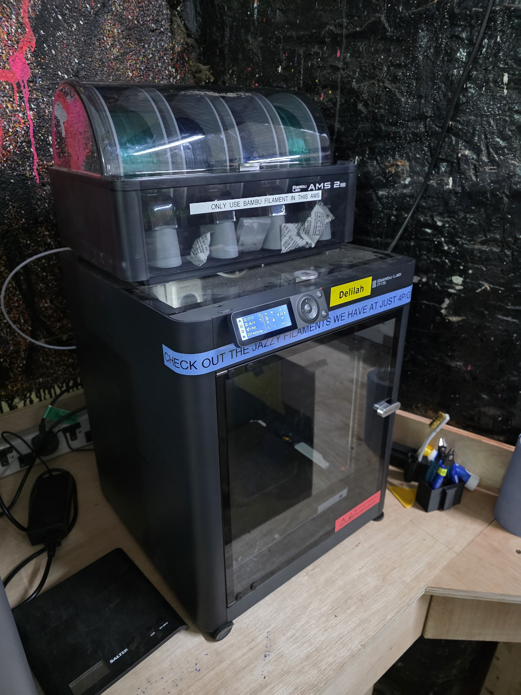
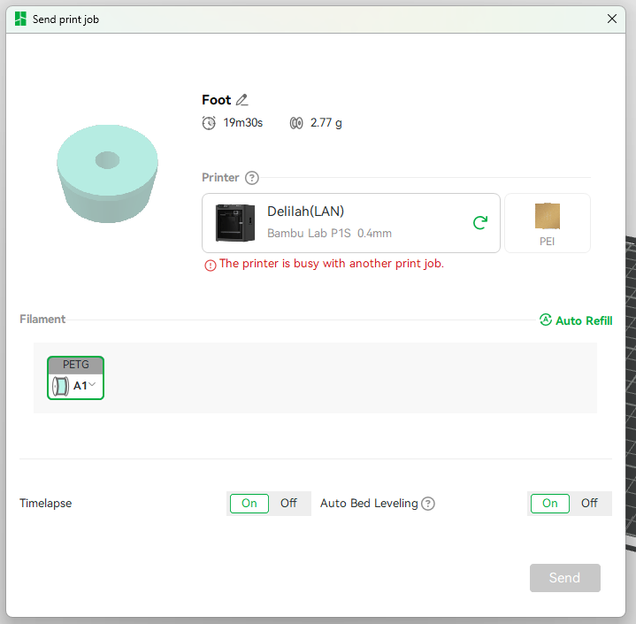

# Using the Bambu P1S and P2S

General rules and preparation are covered in [Getting Started](getting_started.md). This page contains Bambu-specific operation. IP addresses and access codes are kept on [Connect Your Computer to the Printers](connecting.md).

<figure markdown="1">
  
  <figcaption>A HacMan Bambu P2S fitted with an AMS 2 Pro.</figcaption>
</figure>

<figure markdown="1">
  
  <figcaption>The HacMan Bambu P1S fitted with an AMS 2 Pro.</figcaption>
</figure>

## Slicing

Use Bambu Studio and select the approved profile for the exact physical printer: P1S or P2S, with a 0.4 mm nozzle. Follow the [Bambu Studio beginner guide](bambu_studio.md).

Confirm the physical build-plate type and filament/AMS mapping before sending the job.

## Filament sources

Use the [AMS 2 Pro](ams2pro.md) or the rear spool holder. Never force filament into a feed path.

Bare cardboard spools are prohibited in the AMS.

Abrasive filaments are not compatible with the AMS 2 Pro. Print them from the rear spool holder instead.

Flexible filaments are not compatible with the AMS 2 Pro unless the filament is specifically labelled as suitable for AMS use.

To load an AMS slot, place the spool in the slot, press the grey feeder tab and feed the filament in until the AMS detects it and starts feeding automatically. Do not also run the printer's manual load command.

After loading or changing spools, check the material recorded for every slot and synchronise Bambu Studio before slicing.

<figure markdown="1">
  
  <figcaption>Check the AMS slots before printing and synchronise the filament information in Bambu Studio.</figcaption>
</figure>

## Materials

ABS and ASA may be printed only on these enclosed, carbon-filtered printers. Metal-filled filament is prohibited.

The Bambu printers have hardened nozzles, but AMS compatibility is stricter than printer compatibility. If a material is abrasive, flexible, brittle, rough or otherwise unusual, use the rear spool holder or ask before using it with the AMS.

## Starting a print

In Bambu Studio's send dialog, confirm:

- the intended physical printer;
- build-plate type;
- nozzle/profile;
- material and AMS slot mapping; and
- displayed thumbnail, time and weight.

Do not send to a printer that is busy, out of service or not the one used for slicing. Watch the first layer after starting.

<figure markdown="1">
  
  <figcaption>Before sending a Bambu print, check the printer, plate type and filament mapping.</figcaption>
</figure>

## Faults

Do not dismantle the enclosure, print head, feeder or AMS. Do not update firmware or change machine-wide settings unless authorised. Stop and report errors that are not resolved by the basic on-screen procedure.

Do not change the shared access code, disable LAN mode or bind a printer to a personal account.
