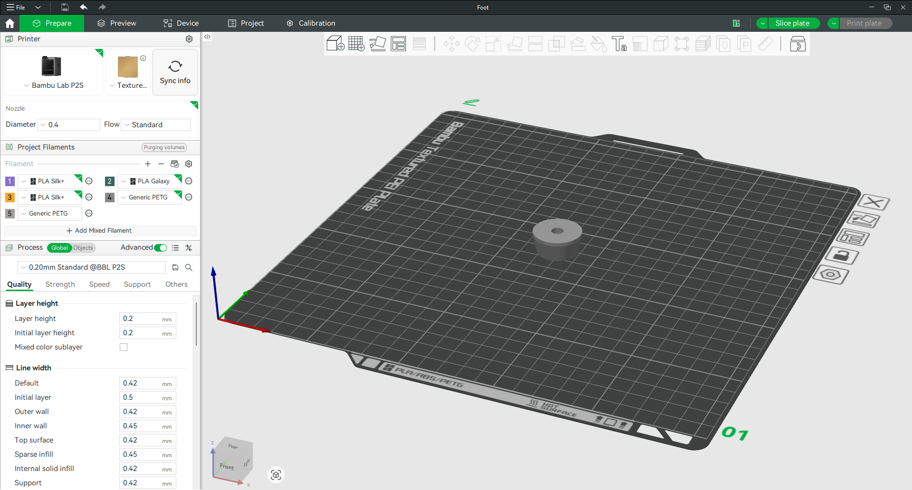
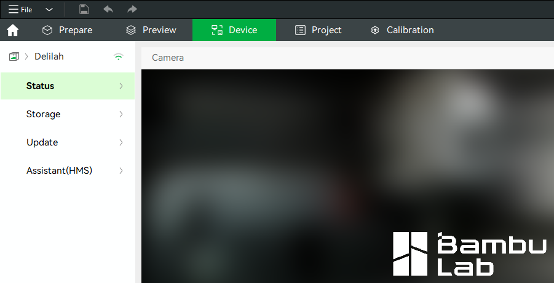
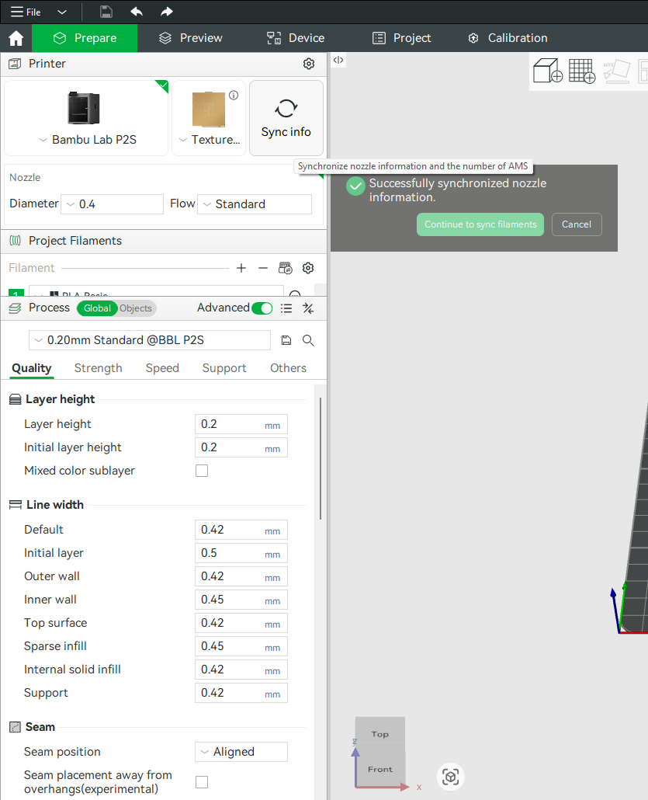
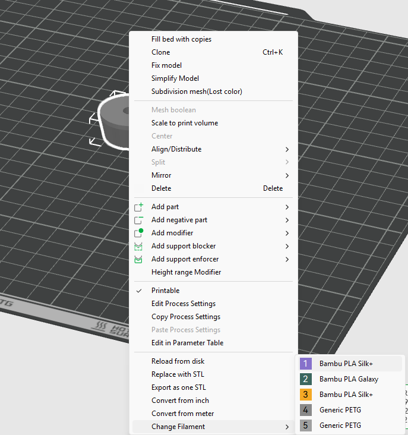
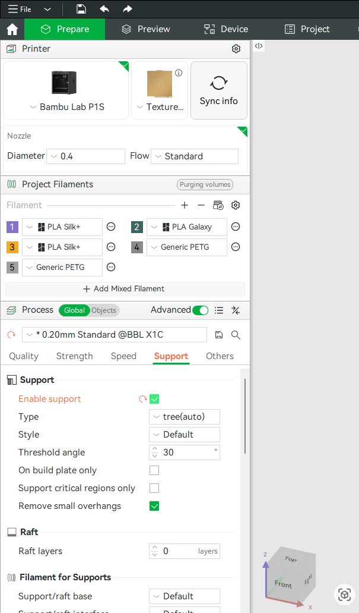
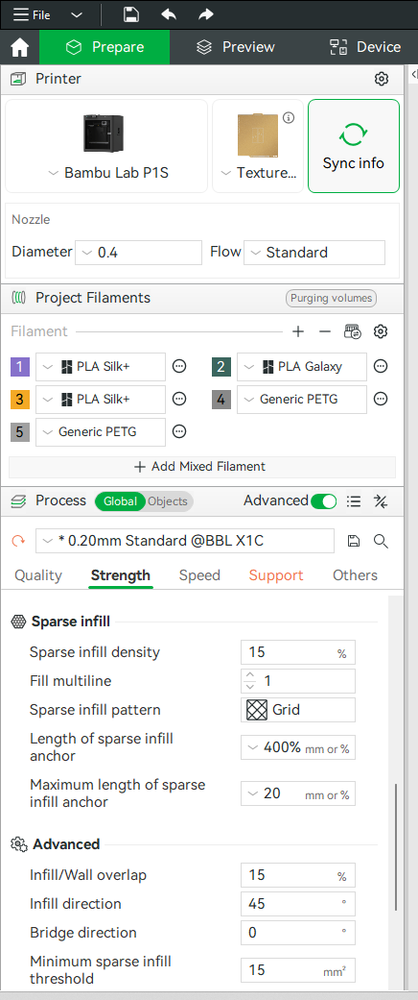
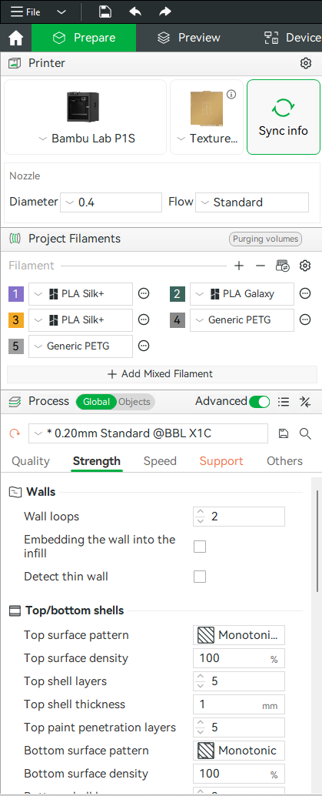
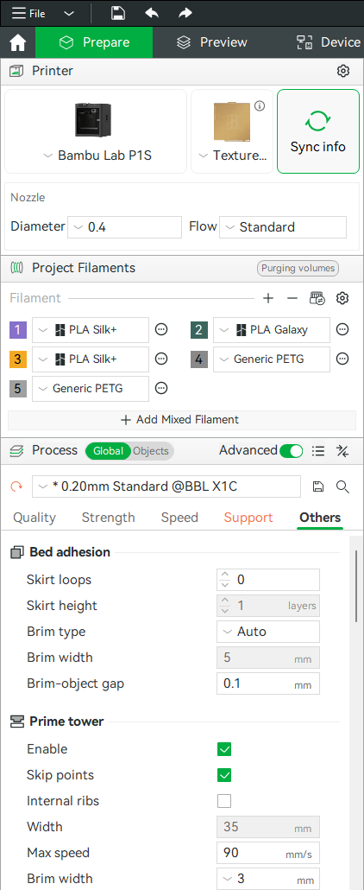

# Beginner's Guide to Bambu Studio

This guide covers the settings most beginners need to prepare and send a model. It does not cover multi-colour painting, modifiers or detailed profile tuning.

<figure markdown="1">
  
  <figcaption>The Prepare view shows the selected printer, plate type, project filaments, the model on the build plate and the Slice plate button.</figcaption>
</figure>

## 1. Start a project and import the model

Open a new project, then drag an STL, 3MF or STEP file onto the virtual plate or use **Import**.

If a downloaded 3MF asks whether to open the complete project or import geometry, use **geometry only** unless you trust and intend to use the supplied printer and filament settings.

## 2. Select the exact printer

Choose the HacMan profile for the physical printer you intend to use:

- Bambu Lab P1S with 0.4 mm nozzle; or
- Bambu Lab P2S with 0.4 mm nozzle.

⚠ **Check:** P1S and P2S profiles are not interchangeable. Confirm the printer name again in the send dialog before starting.

<figure markdown="1">
  
  <figcaption>On the Device tab, the current printer is shown on the left. Click the arrow next to the printer name to open the printer list.</figcaption>
</figure>

## 3. Select the build plate

Choose the plate type that is physically fitted to the printer. The slicer uses this choice to set plate temperature and other behaviour.

<figure markdown="1">
  
  <figcaption>The plate type selector is shown in the Prepare view. Match this to the build plate fitted to the printer.</figcaption>
</figure>

## 4. Synchronise the AMS filaments

Bambu Studio keeps two related lists:

- the **project filament list** in the Prepare tab, which tells the slicer which materials the model will use; and
- the **physical AMS slots**, which show the spools currently loaded in the selected printer.

They are not automatically the same. After selecting the intended physical printer:

1. Check that the AMS spools are loaded and identified correctly on the printer's **Device** page.
2. Return to **Prepare**.
3. In the Filament section, press the **Synchronise/Resync AMS filaments** button beside the filament list.
4. Confirm the synchronisation when prompted. This replaces or updates the project filament list from the selected printer's AMS.
5. Check every imported material. For non-RFID or third-party spools, confirm that the material profile has been entered correctly rather than relying on the displayed colour.

Synchronise again if someone changes a spool after the project was opened.

⚠ **Check:** Make sure Bambu Studio is connected to the intended P1S or P2S before synchronising. Otherwise you may import the filament list from the wrong printer.

<figure markdown="1">
  
  <figcaption>Use Sync info to synchronise printer, nozzle and AMS information. After nozzle information is synced, continue to sync the AMS filaments.</figcaption>
</figure>

## 5. Select which filament prints the model

Synchronising makes the filaments available to the project; it does not necessarily assign the desired one to each model.

For a single-colour model:

1. Select the model on the plate or in the Objects list.
2. Use its filament/colour control, or right-click and choose **Change filament**.
3. Select the numbered project filament that matches the material and colour you want.
4. Confirm that the model changes to the selected filament colour in Prepare.

For a plate containing separate objects, select each object and assign its filament in the same way. Do not use colour painting for an ordinary single-colour object.

Before slicing, check the material name as well as the colour. Two spools can look similar but require different temperatures.

📌 **HacMan rules:** Do not put bare cardboard spools in the AMS. ABS and ASA may only be printed on the enclosed Bambu printers. Metal-filled filament is prohibited.

<figure markdown="1">
  
  <figcaption>Right-click an object and use Change Filament to choose which AMS slot or material that object should print with.</figcaption>
</figure>

## 6. Choose a standard process

For an ordinary first print, use a standard **0.20 mm** process profile. Leave advanced settings at the HacMan defaults unless you understand why they need changing.

## 7. Check orientation and placement

Make sure the model:

- sits flat on the plate;
- stays inside the printable area; and
- has a sensible, stable face against the plate.

Use **Lay on Face** or **Auto Orient** if necessary. Ask for help if large areas would start in mid-air, as the model may need supports.

## 8. Decide whether the model needs supports

Each new layer needs plastic or the build plate beneath it. An **overhang** is a feature that extends sideways beyond the layer below. Gentle slopes may print unaided, while steep overhangs and features beginning in mid-air may need temporary support material.

First try orienting the model to reduce unsupported areas. If support is still required, enable **Support**. Start with support from the build plate only where practical; use support everywhere only when the required area cannot be reached from the plate.

Supports add time and filament and may mark the model. Inspect them in Preview and make sure they can be removed after printing.

<figure markdown="1">
  
  <figcaption>Support settings are under the Support tab. Supports are used when parts of the model would otherwise print into mid-air.</figcaption>
</figure>

## 9. Choose infill and wall thickness

**Infill** is the internal structure inside the model. It supports top surfaces and helps resist crushing.

- **15% infill** is a sensible starting point for decorative and lightly loaded parts.
- Increase it for compression loads or when top surfaces need more internal support.
- 100% infill is rarely necessary.

The outer shell is made from **wall loops**. More walls usually improve general strength more efficiently than a large increase in infill:

- use the standard profile for ordinary models;
- try **3–4 wall loops** for a stronger functional part; and
- orient the part so loads do not try to split it between layers.

<figure markdown="1">
  
  <figcaption>Infill settings are under Strength. Higher infill can make some parts stronger, but wall thickness often matters more.</figcaption>
</figure>

<figure markdown="1">
  
  <figcaption>Wall loops are under Strength → Walls. Increasing wall loops often improves part strength more effectively than simply increasing infill.</figcaption>
</figure>

## 10. Add a brim when needed

A **brim** is a thin, single-layer border attached around the model's base. It increases contact with the build plate and helps narrow, tall or corner-prone models remain attached.

Use one when the footprint is small or likely to lift. A broad, stable model normally does not need it. The brim must be removed after printing and may leave a small edge to tidy.

<figure markdown="1">
  
  <figcaption>Brim and skirt settings are under Others → Bed adhesion. A brim can help small or narrow parts stay attached to the build plate.</figcaption>
</figure>

## 11. Slice the plate

Select **Slice plate**.

Bambu Studio opens Preview and calculates print time and filament use.

## 12. Inspect the preview

Use the vertical layer slider to examine the result. Check that:

- the complete model is present;
- every section is supported by the plate, the previous layer or generated supports;
- the time and filament estimates are plausible; and
- the colours/filament assignments match your intention.

Return to Prepare and correct anything unexpected before printing.

## 13. Map project filaments to physical AMS slots and send

Select **Print plate**. In the send dialog:

1. Choose the intended physical HacMan printer.
2. Confirm the build plate type.
3. In the filament-mapping area, match each **project filament** used by the sliced model to the correct **physical AMS slot**. The material types must be compatible; check both the slot number and material name.
4. Review the displayed time, weight and thumbnail.
5. If a filament is shown as **Unmapped**, do not send the job. Correct the project filament, load the required material, or choose the correct compatible AMS slot.
6. Send the job only when every item is correct.

If the intended printer is unavailable, out of service or already in use, cancel the send operation.

<figure markdown="1">
  
  <figcaption>Before sending, check the printer, plate type and filament. Bambu Studio may ask you to allocate a filament here and will only offer compatible material types for the model.</figcaption>
</figure>

## Before pressing Print

- Correct P1S or P2S profile
- Correct 0.4 mm nozzle
- Correct physical plate type
- Correct material and AMS slot
- AMS synchronised after any spool change
- Each object assigned to the intended project filament
- Final project-to-AMS mapping checked
- Model fits and sits flat
- Supports added only where needed
- Infill and wall-loop count suitable for the job
- Brim added if the footprint needs more adhesion
- Preview checked
- Physical build plate clean, dry and correctly fitted

Stay and watch the first layer after the print starts.

## Official reference

Bambu Studio is maintained in Bambu Lab's [official Bambu Studio repository](https://github.com/bambulab/BambuStudio). Interface details may change between releases, so screenshots should show the HacMan-installed version.
