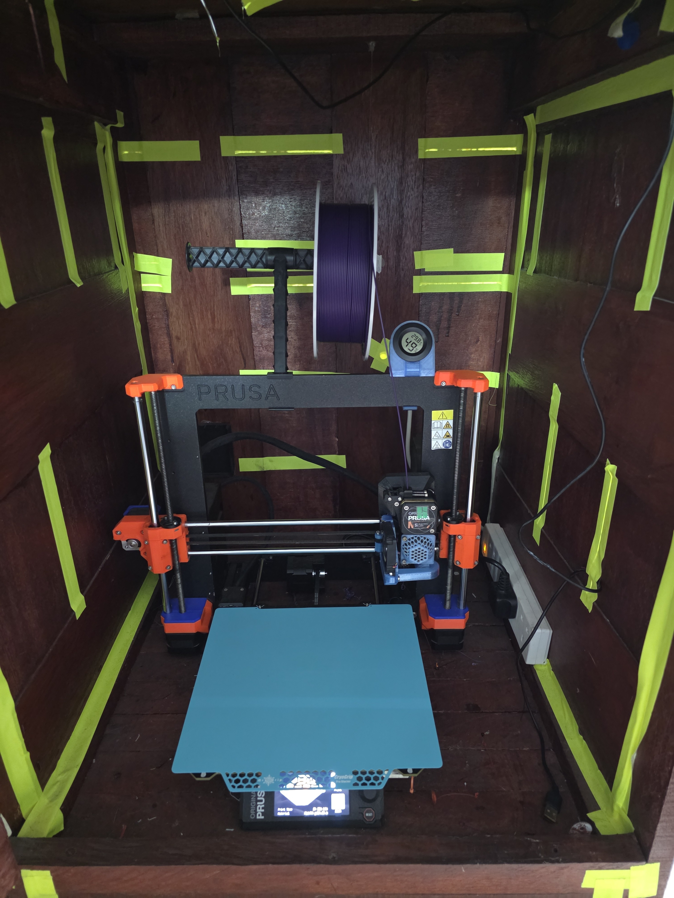
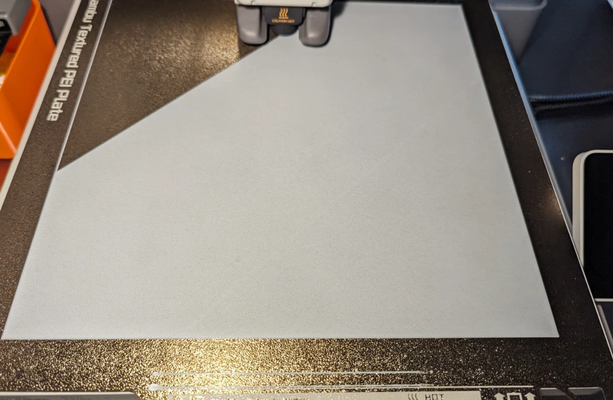
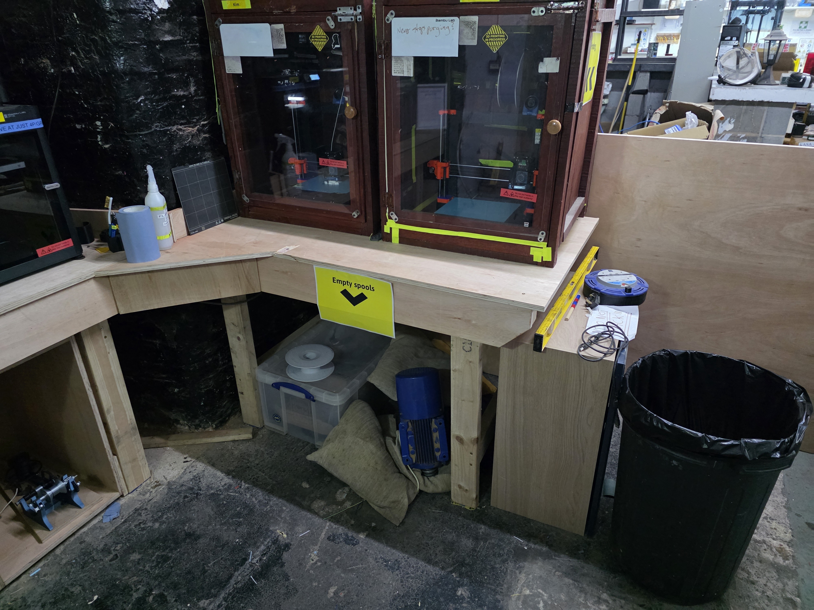

# Getting Started

Complete the [self-induction](induction.md) and pass the online assessment before independent use.

## 1. Prepare the model

You can design your own model in CAD, but you do not need to do that for your first print. Many members start with a ready-made STL or 3MF file from sites such as [Printables](https://www.printables.com/), [MakerWorld](https://makerworld.com/), [Thingiverse](https://www.thingiverse.com/), [Thangs](https://thangs.com/) or [MyMiniFactory](https://www.myminifactory.com/).

For a first print, choose something small, simple and clearly marked as printable. Check the licence and avoid very large or complex models until you are comfortable with the workflow.

Open the model in [PrusaSlicer](prusaslicer.md) for a Prusa MK4 or [Bambu Studio](bambu_studio.md) for a Bambu printer. Select the exact printer, nozzle, build plate where applicable and filament profile.

Slice the model and inspect the preview. Check the estimated time and filament use.

## 2. Check the printer

- Available and not marked out of service
- Build plate clean, dry and correctly fitted
- Correct filament loaded and enough remaining
- Spool able to rotate freely
- No previous print, tool or debris in the build area

<figure markdown="1">
  
  <figcaption>Leave printers clean, tidy and ready for the next member.</figcaption>
</figure>

## 3. Start and watch

Start the job and remain beside the printer until the first layer is complete. Stop if the filament does not stick, the print lifts, spaghetti forms, feeding stops or the printer behaves unexpectedly.

<figure markdown="1">
  
  <figcaption>A good first layer should be smooth and firmly attached to the build plate.</figcaption>
</figure>

A competent member must remain in the Hackspace for the entire print.

## 4. Remove the print

Let the plate cool where possible. Remove it from the printer and flex it gently away from people. Clean, dry and refit it squarely.

<figure markdown="1">
  
  <figcaption>Remove the build plate from the printer before flexing it to release a print.</figcaption>
</figure>

## 5. Finish

Remove waste, return tools, secure filament ends, report faults and pay 4p per gram through Snackspace for all Hackspace filament used.

<figure markdown="1">
  
  <figcaption>Return tools and dispose of waste before leaving the printer area.</figcaption>
</figure>
