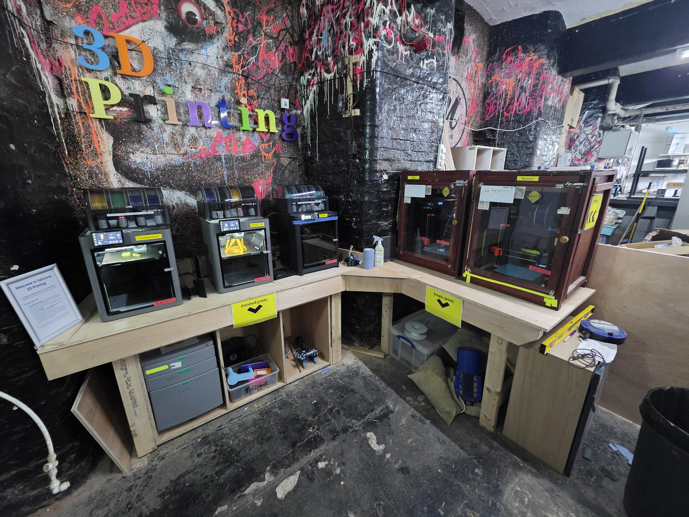

# FDM 3D Printing

HacMan provides five FDM printers for members who have completed the [self-induction](induction.md):

<figure markdown="1">
  
  <figcaption>The HacMan FDM printer area.</figcaption>
</figure>

- 2 × Prusa MK4
- 2 × Bambu Lab P2S with AMS 2 Pro
- 1 × Bambu Lab P1S with AMS 2 Pro

All use 1.75 mm filament and hardened nozzles.

## Become an inducted user

1. Read the [FDM Self-Induction Handbook](induction.md).
2. Complete the online assessment.
3. Achieve 100%.

No routine face-to-face sign-off is required. Ask an experienced member if you would like help with your first print.

## Start here

- [Self-Induction Handbook](induction.md)
- [Printer Rules](printer_rules.md)
- [Getting Started](getting_started.md)
- [Filament Guide](filament.md)
- [Using the Prusa MK4](prusa_mk4.md)
- [Using the Bambu P1S and P2S](bambu_p1s_p2s.md)
- [Using the AMS 2 Pro](ams2pro.md)
- [Connect Your Computer to the Printers](connecting.md)
- [Troubleshooting](troubleshooting.md)
- [PrusaSlicer beginner guide](prusaslicer.md)
- [Bambu Studio beginner guide](bambu_studio.md)
