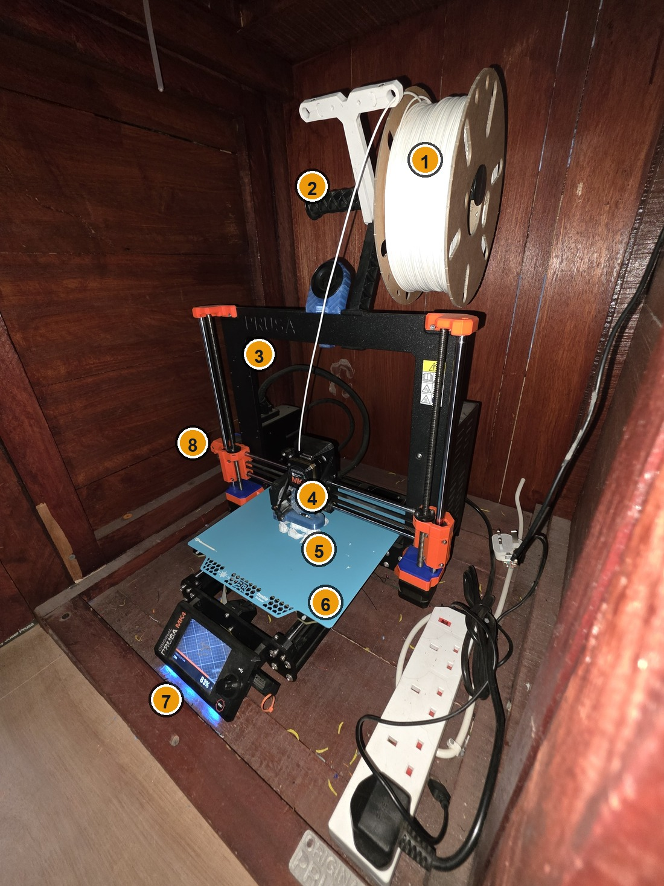
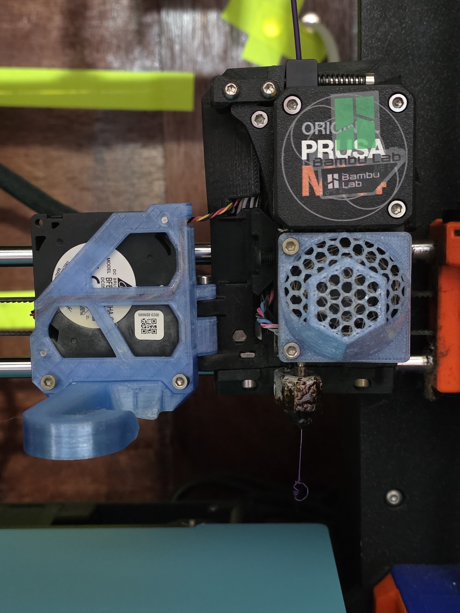
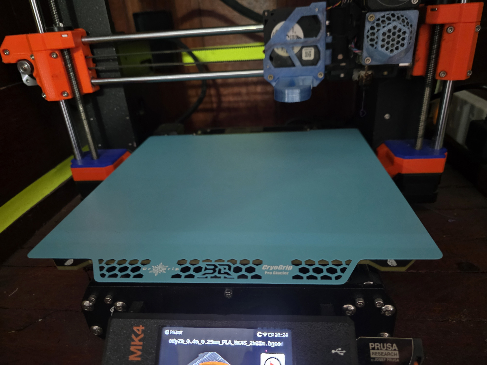
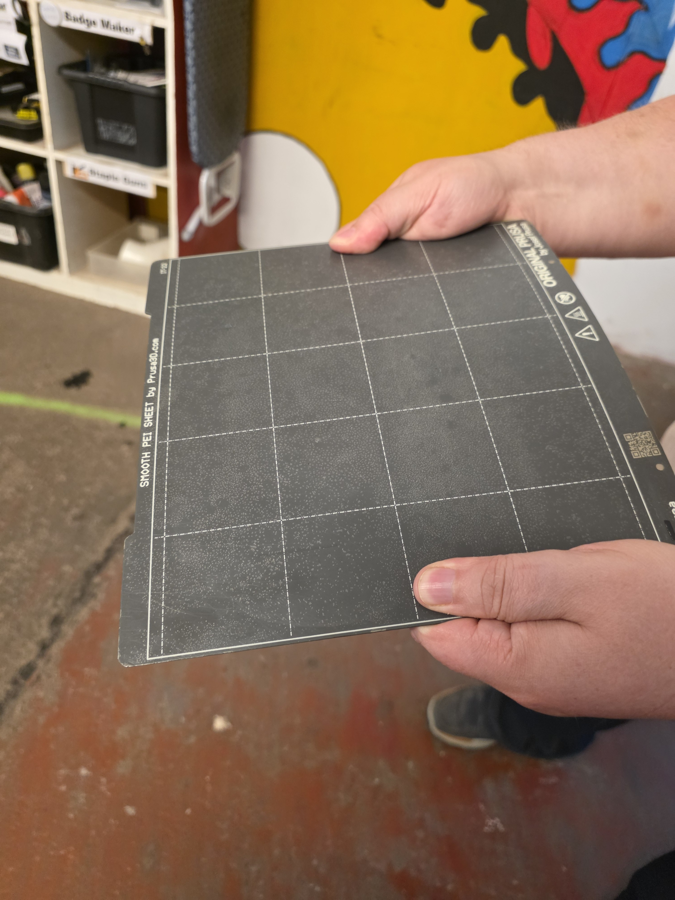
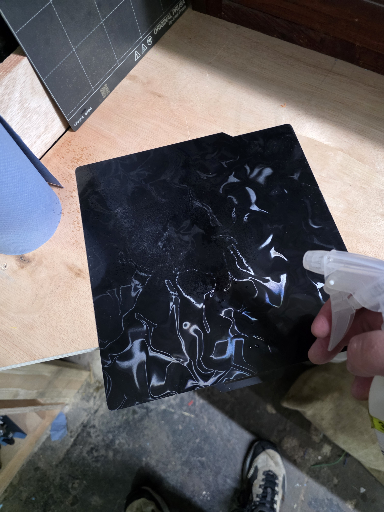
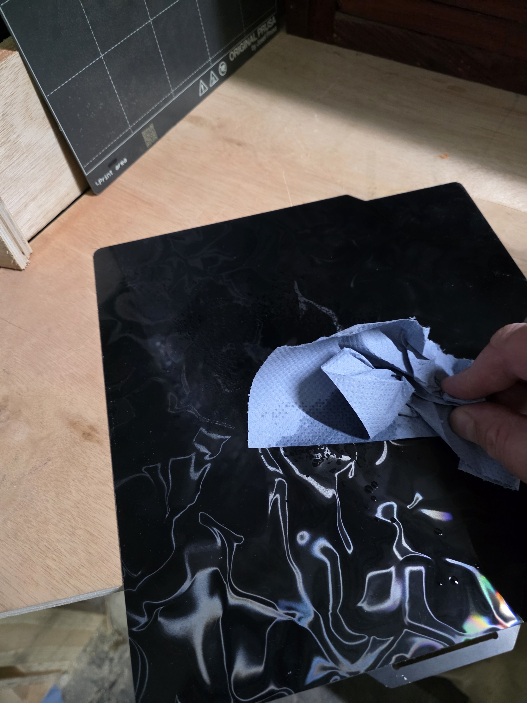
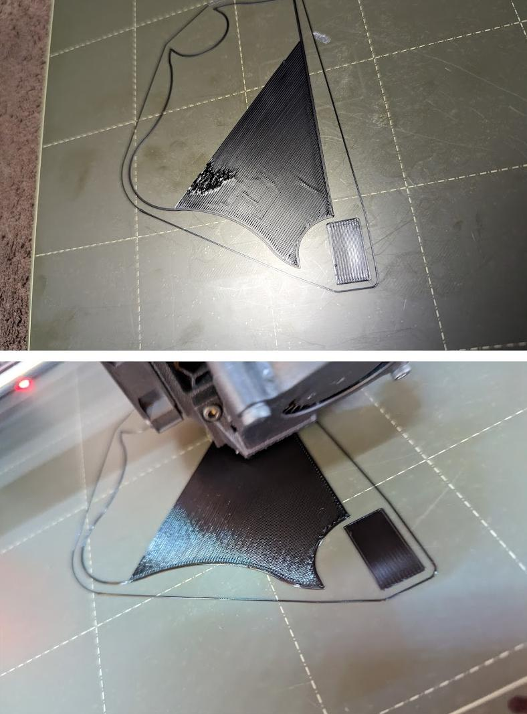
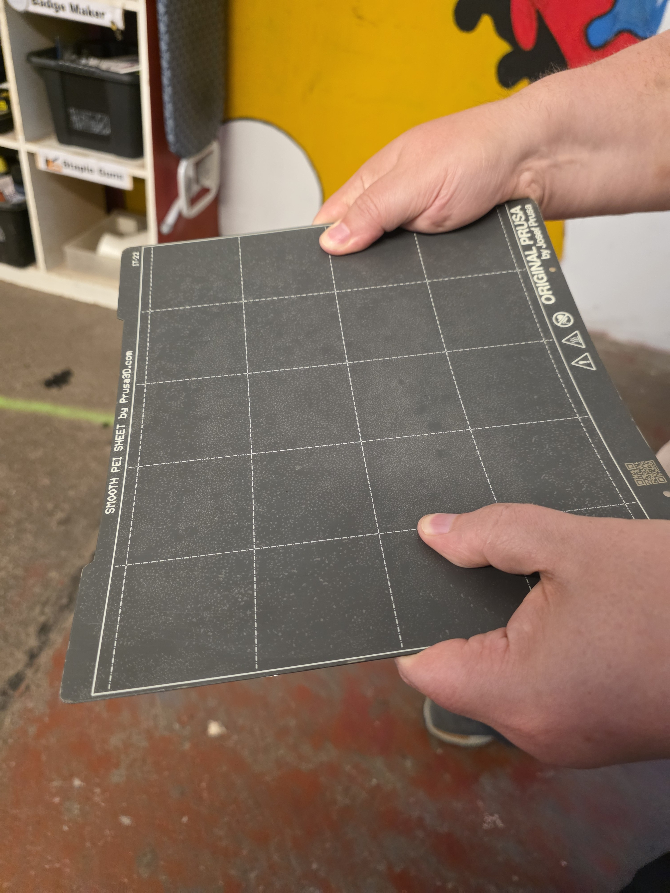
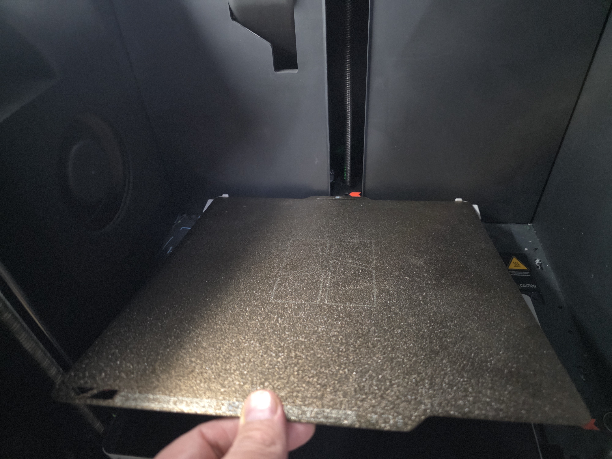

# HacMan FDM 3D Printing

## Self-Induction Handbook

> ## Before You Begin
>
> Please read this entire **Self-Induction Handbook** before attempting the quiz. The information on this page is designed to help you successfully complete the assessment and understand HacMan's safety requirements.
>
> Once you have read the whole page, complete the **Self-Induction Quiz** here:
>
> **[Start the Self-Induction Quiz](https://forms.gle/pGwzDXJ5jYph236w7)**

<figure markdown="1">
  
  <figcaption>The HacMan FDM printer area.</figcaption>
</figure>

## Welcome

This handbook enables HacMan members to learn to use the Hackspace's FDM printers safely and independently. No previous 3D-printing experience is required. It should take about 10–15 minutes to read.

After reading it, complete the online assessment. You must score **100%** before using the printers independently. Experienced members are always available if you would like help with your first print.

This handbook covers safe operation, Hackspace rules, filament handling, build-plate care, starting and monitoring a print, cleaning up and dealing with problems. Separate guides explain basic slicing in PrusaSlicer and Bambu Studio.

## Finding a first model

You do not need to know CAD to do your first 3D print. Many beginners start by downloading a ready-made model online, usually as an STL or 3MF file.

Common places to find printable models include:

- [Printables](https://www.printables.com/)
- [MakerWorld](https://makerworld.com/)
- [Thingiverse](https://www.thingiverse.com/)
- [Thangs](https://thangs.com/)
- [MyMiniFactory](https://www.myminifactory.com/)

For your first print, choose something small and simple that does not need lots of support material. Check the licence and description before printing, especially if the model is not your own work.

## Our printers

HacMan provides:

- 2 × Prusa MK4
- 2 × Bambu Lab P2S with AMS 2 Pro
- 1 × Bambu Lab P1S with AMS 2 Pro

All use 1.75 mm filament and hardened nozzles. Most instructions apply to every printer; model-specific differences are identified where necessary.

<figure markdown="1">
  
  <figcaption>One of the HacMan Prusa MK4 printers.</figcaption>
</figure>

<figure markdown="1">
  
  <figcaption>A HacMan Bambu P2S fitted with an AMS 2 Pro.</figcaption>
</figure>

<figure markdown="1">
  
  <figcaption>The HacMan Bambu P1S fitted with an AMS 2 Pro.</figcaption>
</figure>

<figure markdown="1">
  
  <figcaption>Key parts of a Prusa MK4. The Bambu printers look different, but the same basic ideas apply.</figcaption>
</figure>

1. **Filament spool** - the plastic filament used for printing.
2. **Spool holder** - supports the filament spool so it can rotate freely.
3. **Frame** - the main structure of the printer.
4. **Print head / extruder** - feeds and moves the filament.
5. **Nozzle / hot end** - melts plastic and gets very hot.
6. **Build plate** - the removable sheet the print sticks to.
7. **Screen and controls** - used to control the printer and read messages.
8. **Z-axis upright** - part of the moving frame; keep hands clear while the printer moves.

## Golden rules

1. Never leave a running printer without a competent member in the Hackspace. This is an insurance requirement.
2. Stay at the printer and watch the first layer complete successfully.
3. Stop the print if anything looks or sounds wrong.
4. Never force filament, the AMS or moving parts.
5. Do not attempt repairs or maintenance unless authorised.
6. Leave the printer and materials ready for the next member: remove waste, return tools, secure loose filament ends and pay for Hackspace filament.
7. Never start a print without the removable build plate correctly fitted to the printer.

## Safety

### Hot parts

⚠ **Warning:** The nozzle may reach about 290°C and the heated build plate may reach about 120°C. Never touch the nozzle, avoid touching a hot plate and remember that freshly extruded plastic is hot.

<figure markdown="1">
  
  <figcaption>The nozzle is one of the hottest parts of the printer. Do not touch it.</figcaption>
</figure>

<figure markdown="1">
  
  <figcaption>The build plate can also become hot during printing.</figcaption>
</figure>

### Moving parts

⚠ **Warning:** Printers may move suddenly while homing or calibrating. Keep hands clear, tie back long hair and keep loose clothing and jewellery away. Never reach inside while a printer is moving.

### Magnets and trapped fingers

⚠ **Warning:** Build plates are held by strong magnets. Keep fingers clear when replacing a plate. Anyone with a pacemaker or other implanted medical device must follow its manufacturer's advice about strong magnets.

### Flying debris

⚠ **Warning:** Plastic or support material may release suddenly when a spring-steel plate is flexed. Remove the plate from the printer and flex it away from yourself and other people. Consider eye protection for a stubborn print.

<figure markdown="1">
  
  <figcaption>Remove the flexible build plate from the printer before flexing it to release a print.</figcaption>
</figure>

### IPA, water and electricity

⚠ **Warning:** Isopropyl alcohol (IPA) is flammable and can irritate eyes. Apply a small amount to a cloth, not directly to a printer. Remove plates before cleaning and never refit a wet plate. Do not dismantle printers or attempt electrical repairs.

If you see damaged wiring, overheating, smoke or an unusual smell, stop the printer and isolate its power if it is safe to do so. Alert other members and follow the normal Hackspace emergency procedure.

## Hackspace rules

### Supervision

📌 **Hackspace rule:** A competent member must remain in the Hackspace throughout every print. If you need to leave, another competent member must explicitly agree to supervise it. If nobody agrees, pause or cancel the print. Remote monitoring does not satisfy this insurance requirement.

You do not have to remain beside the printer for the whole job. It is, however, advisable to watch until the first layer completes successfully.

### Shared equipment

📌 **Hackspace rule:** Do not dismantle a printer or AMS, change hardware, perform maintenance or attempt repairs unless authorised. Do not remove or cancel another member's print unless asked, you have agreed to supervise it, there is an immediate safety concern, or you are the last person leaving the Hackspace and cannot identify anyone supervising a running print.

Stop using and report any printer that is marked out of service, appears damaged, repeatedly errors or makes unusual noises.

## Before printing

Check that:

- the printer is available and not marked out of service;
- the build plate is correctly fitted, clean and completely dry;
- the correct filament is loaded and there is enough for the job;
- the spool can rotate freely; and
- no print, tool or loose debris remains in the printer.

Confirm the correct printer and filament profile in your slicer before sending the job.

### Cleaning the build plate

For routine cleaning, remove the plate and wipe it with a small amount of IPA on clean paper towel or a lint-free cloth. Avoid touching the print surface afterwards.

For a deeper clean, wash the removed plate with warm water and washing-up liquid. Rinse it and dry it completely before refitting.

⚠ **Warning:** Do not clean a plate while it is fitted to the printer and never refit it while wet.

<figure markdown="1">
  
  <figcaption>Clean build plates after removing them from the printer. Apply IPA to the plate or cloth, not to the printer.</figcaption>
</figure>

<figure markdown="1">
  
  <figcaption>Always dry the build plate completely before refitting it.</figcaption>
</figure>

<figure markdown="1">
  
  <figcaption>Fingerprints and grease can stop prints sticking properly. Clean the plate before printing.</figcaption>
</figure>

## Filament

### Loading and unloading

Use the printer's built-in load or unload function and follow its on-screen prompts. Cut a damaged or bent filament end cleanly before loading. Feed gently until the printer takes hold; never force it.

On a Prusa, place the spool on its holder and guide the filament into the extruder when prompted. On a Bambu, use an AMS slot or the rear spool holder and confirm the intended source in the print settings.

For more detail, see [Using the Prusa MK4](prusa_mk4.md), [Using the Bambu P1S and P2S](bambu_p1s_p2s.md) and [Using the AMS 2 Pro](ams2pro.md).

### AMS

Before using an AMS, check that the spool rotates freely, the filament is correctly routed and the lid closes properly.

Bambu filament spools with RFID can tell the printer what material and colour they are. Other filament brands need the AMS slot material and colour to be set manually on the printer or in Bambu Studio.

To load filament into the AMS, place the spool in an empty slot, cut the filament end cleanly, gently push the grey feeder tab and feed the filament into the slot inlet until the AMS detects it and starts loading. Do not keep pushing once the AMS motor has gripped the filament.

To unload filament from the AMS, use the printer or Bambu Studio unload function and wait for the AMS to retract the filament. Then press the feeder tab and remove the filament by hand. If there is resistance, do not force it; ask for help. Once removed, secure the loose end of the spool immediately.

📌 **Hackspace rule:** Never place a bare cardboard spool directly in an AMS. Use a suitable plastic spool or correctly fitted adapter rings.

### Materials

- PLA, PETG, TPU and abrasive composite filaments may be used on suitable HacMan printers.
- TPU must only be used in an AMS if it is specifically marked as suitable for AMS use. Standard flexible TPU should be printed without the AMS to avoid feed problems and clogs.
- Abrasive, fibre-filled, brittle or unusual filaments may be suitable for the printer nozzle but not necessarily for the AMS. If unsure, print from the rear spool holder or ask before using the AMS.
- ABS and ASA must only be printed on the enclosed Bambu printers with carbon filtration.
- Metal-filled filament is prohibited on every HacMan printer.
- Ask the 3D printing team before using a material if you are unsure.

### Storage

📌 **Hackspace rule:** Secure the free end of every removed spool in its holes or retaining clip before storage. A loose end can unwind and create a tangle that ruins a later print.

Remove personal filament from the printer after use. Take it home or put it in your personal storage area if you have one; do not leave it on a printer or in the shared filament area.

<figure markdown="1">
  
  <figcaption>Filament entering the Prusa MK4 extruder.</figcaption>
</figure>

<figure markdown="1">
  
  <figcaption>Spools should sit correctly in the AMS and rotate freely.</figcaption>
</figure>

<figure markdown="1">
  
  <figcaption>Do not use bare cardboard spools in the AMS. TPU should only be used in the AMS if it is specifically suitable for AMS use.</figcaption>
</figure>

<figure markdown="1">
  
  <figcaption>Secure the free end of every removed spool before storing it.</figcaption>
</figure>

## Starting and monitoring a print

Start the job through the printer or supported software. Heating, homing, calibration, bed probing and a small filament purge are normal. Keep hands clear.

Stay beside the printer and watch the first layer. A good first layer has continuous lines firmly attached to the plate with no lifting edges.

Stop the print if:

- filament does not stick;
- the print lifts or detaches;
- filament collects around the nozzle or forms “spaghetti”;
- feeding stops;
- the printer reports an error or makes unusual noises; or
- continuing may damage the printer.

Once the first layer is successful, you may use other parts of the Hackspace, but a competent member must remain present and the print should be checked periodically.

<figure markdown="1">
  
  <figcaption>A good first layer has smooth, continuous lines attached to the build plate.</figcaption>
</figure>

<figure markdown="1">
  
  <figcaption>Stop the print if the first layer is not sticking or is dragging badly.</figcaption>
</figure>

<figure markdown="1">
  
  <figcaption>A spaghetti failure should be stopped promptly. Do not leave it to continue.</figcaption>
</figure>

## Removing a print

Let the plate cool where possible. Remove the magnetic plate from the printer, point it away from people and flex it gently until the print releases. Do not flex it on the printer and do not use excessive force.

If a scraper is needed, use a plastic scraper only. Do not use metal scrapers on the build plate.

If the print remains stuck, allow more cooling and ask for help. Remove loose plastic, check that the plate is clean and dry, and refit it squarely while keeping fingers clear of the magnets.

<figure markdown="1">
  
  <figcaption>Remove the flexible build plate before trying to release the print.</figcaption>
</figure>

<figure markdown="1">
  
  <figcaption>Flex the plate gently, pointing it away from yourself and other people.</figcaption>
</figure>

<figure markdown="1">
  
  <figcaption>Refit the build plate squarely and make sure it is seated correctly before printing.</figcaption>
</figure>

## Finishing and payment

Before leaving:

- remove your print and all waste;
- leave the build plate clean, dry and correctly fitted;
- return tools and cleaning supplies;
- remove personal filament from the printer, taking it home or putting it in your personal storage area if you have one;
- secure the loose end of every removed spool; and
- report faults.

Hackspace filament costs **4p per gram**. Pay through the Snackspace tuck shop for all Hackspace filament used, including failed or cancelled prints.

<figure markdown="1">
  
  <figcaption>Pay for Hackspace filament through the Snackspace tuck shop.</figcaption>
</figure>

## If something goes wrong

Pause or cancel the print. Do not force filament, axes or AMS parts, and do not dismantle equipment. Read any displayed error, then ask an experienced member or report the fault if the solution is not part of the basic procedure in this handbook.

<figure markdown="1">
  
  <figcaption>If filament builds up around the nozzle or print head, stop and ask for help.</figcaption>
</figure>

If smoke, fire or electrical damage creates an immediate danger, stop the printer and isolate its power if safe, alert other members and follow the Hackspace emergency procedure.

## Complete the assessment

You should now understand the hazards, rules and basic workflow for using the printers independently.

**[Complete the FDM printer self-induction assessment](https://forms.gle/pGwzDXJ5jYph236w7)**

A score of **100%** is required before independent use.
