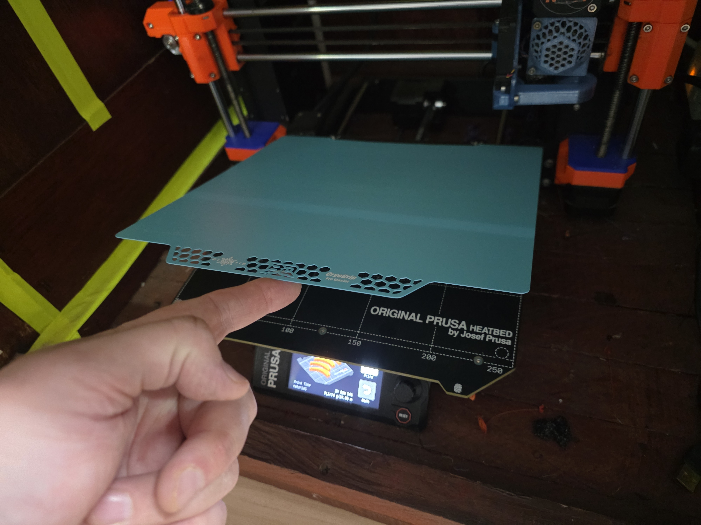
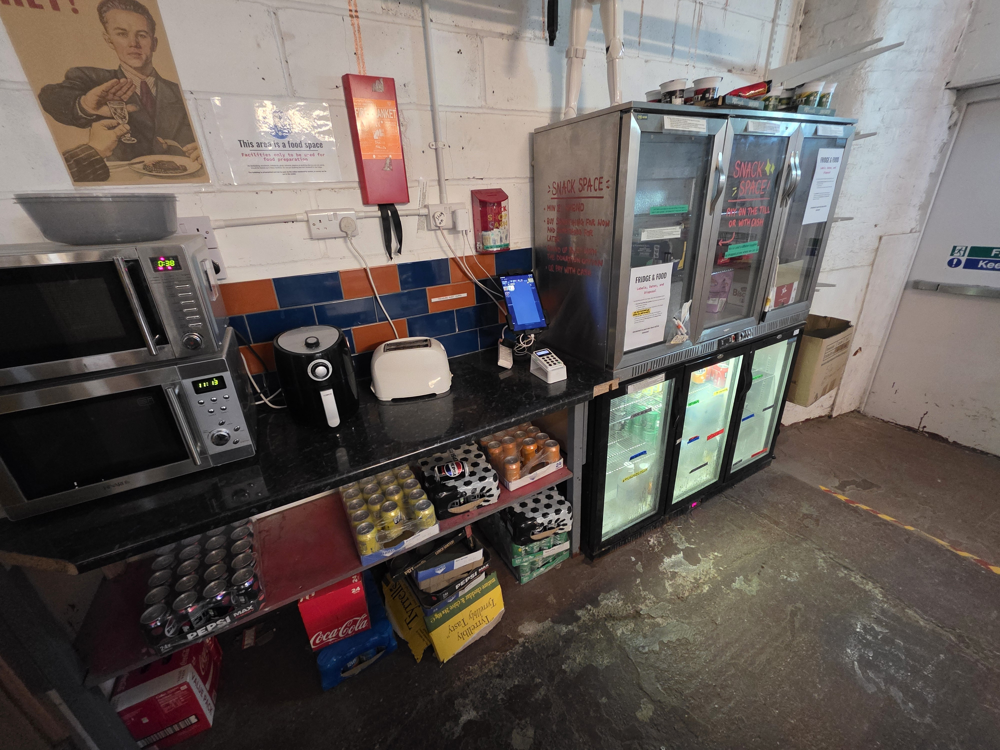

# FDM Printer Rules

These rules apply to every HacMan FDM printer.

## Supervision

Printing must not continue without a competent member in the Hackspace. This is an insurance requirement.

If you need to leave, another competent member must explicitly agree to supervise your print. If nobody agrees, pause or cancel it. Remote monitoring is not a substitute.

Stay beside the printer until the first layer has completed successfully. After that, you may use other parts of the Hackspace while a competent member remains present.

## Protect people and equipment

- Keep clear of hot nozzles, heated plates and moving parts.
- Never force filament, an AMS or a printer axis.
- Do not dismantle, modify, repair or maintain equipment unless authorised.
- Stop and report unusual noises, repeated errors or visible damage.
- Do not use equipment marked out of service.
- Do not remove or cancel another member's print unless asked, you agreed to supervise it, or there is an immediate safety concern.

## Build plates

- Never start a print without the removable build plate correctly fitted.
- Remove a plate before cleaning or flexing it.
- Keep it clean and completely dry.
- Never refit a wet plate.
- Flex it gently and point it away from people.

<figure markdown="1">
  
  <figcaption>Remove the flexible build plate before cleaning it or flexing it.</figcaption>
</figure>

## Filament

- Hackspace filament costs 4p per gram, including failed and cancelled prints. Pay through Snackspace.
- Personal compatible filament may be used.
- ABS and ASA are restricted to the enclosed Bambu printers with carbon filtration.
- Metal-filled filament is prohibited.
- Bare cardboard spools must not be placed directly in an AMS.
- Abrasive filaments must not be used in the AMS 2 Pro. Print them from the rear spool holder instead.
- Flexible filaments must not be used in the AMS 2 Pro unless the filament is specifically labelled as suitable for AMS use.
- Secure the loose end of every removed spool before storage.

<figure markdown="1">
  
  <figcaption>Secure the free end of filament before storage to prevent tangles.</figcaption>
</figure>

## When finished

Remove your print and waste, return tools, leave the plate clean and correctly fitted, secure filament ends, pay for Hackspace filament and report faults. Leave everything ready for the next member.

<figure markdown="1">
  
  <figcaption>Pay for Hackspace filament through the Snackspace tuck shop.</figcaption>
</figure>
