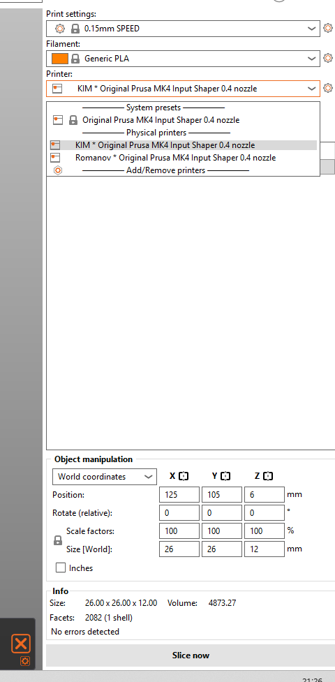
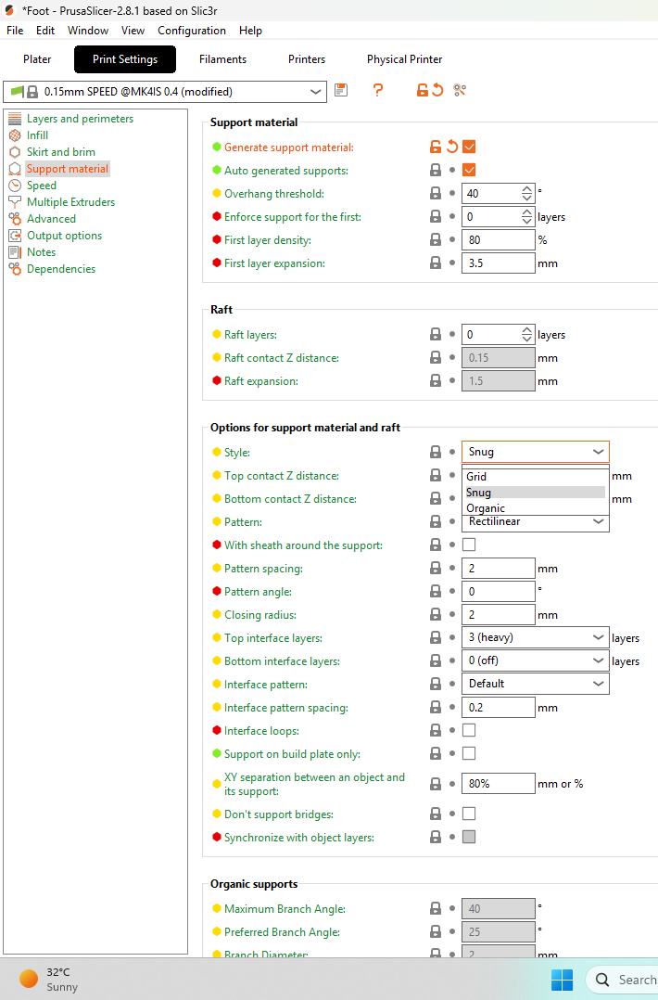
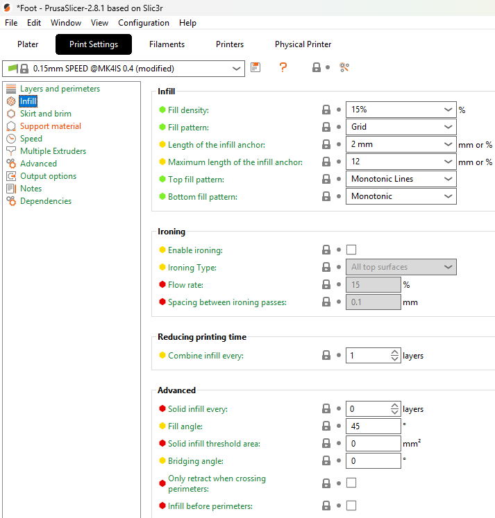
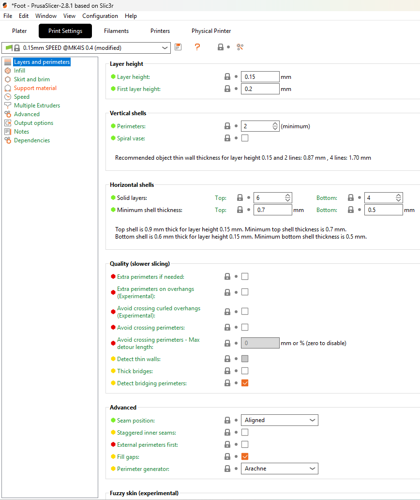
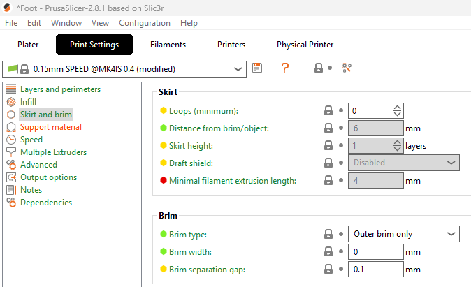
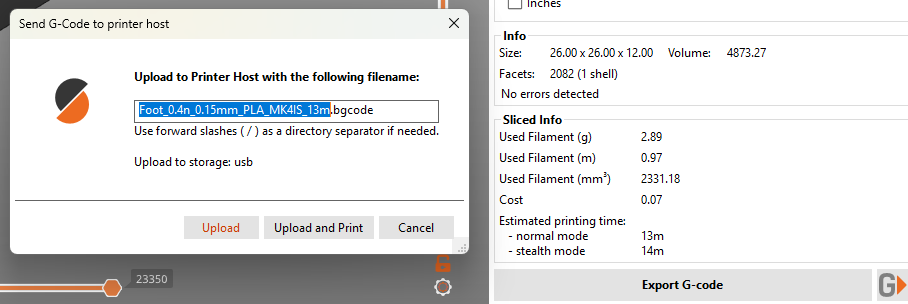

# Beginner's Guide to PrusaSlicer

This guide covers the settings most beginners need to turn a model into a printable file. It does not cover advanced modifiers or detailed tuning.

## 1. Open your model

Drag an STL, 3MF, STEP or OBJ file onto the build plate, or select **Add** from the top toolbar.

The model should appear on the virtual build plate. If a 3MF project asks whether to load the whole project or geometry only, use **geometry only** unless you trust and intend to use the supplied printer settings.

## 2. Select the printer

In the printer selector, choose the HacMan profile for the correct **Prusa MK4 with 0.4 mm nozzle**.

⚠ **Check:** Never slice for a different printer or nozzle size. The virtual plate should match the printer you intend to use.

<figure markdown="1">
  
  <figcaption>Select the correct HacMan Prusa MK4 physical printer before slicing or sending a print.</figcaption>
</figure>

## 3. Select the filament

Choose the profile matching the material that will be loaded, such as PLA, PETG or TPU.

The profile controls temperatures and other material-dependent settings. Do not select a material merely because its colour matches.

## 4. Use a standard print profile

For an ordinary first print, select a standard **0.20 mm** profile. Leave advanced settings at the HacMan defaults unless you understand why they need changing.

## 5. Check orientation and placement

Make sure the model:

- sits flat on the plate;
- is fully inside the printable area; and
- is oriented sensibly, with a stable face against the plate where possible.

If necessary, select the model and use **Place on Face** to put a chosen flat surface on the plate. Ask for help if the model has large sections that would begin printing in mid-air; it may need supports.

## 6. Decide whether the model needs supports

Each printed layer must be supported by the build plate or by plastic beneath it. An **overhang** is a part that extends sideways beyond the layer below. A gentle slope may print without help, but a steep overhang or a feature beginning in mid-air may need temporary support material.

First consider rotating the model so fewer areas need support. If support is still required, enable **Generate support material**. For a straightforward model, start with **On build plate only**; use **Everywhere** only when an overhang cannot be reached from the plate.

Supports consume extra filament, increase print time and can mark the supported surface. Inspect them in Preview and ask for help if they appear inside a cavity where they will be difficult to remove.

<figure markdown="1">
  
  <figcaption>Support settings are in Print Settings → Support material. Supports are used when a model has overhangs that would otherwise print into mid-air.</figcaption>
</figure>

## 7. Choose infill and wall thickness

**Infill** is the internal structure inside a model. It supports top surfaces and helps resist crushing, but more infill also uses more filament and time.

- **15% infill** is a sensible starting point for most decorative and lightly loaded parts.
- Increase it when the part must resist compression or needs more internal support.
- 100% is rarely necessary and is not automatically the strongest or best choice.

The outer shell is formed from **perimeters**, also called walls. Adding walls is usually more effective for general strength than greatly increasing infill:

- use the standard profile for ordinary models;
- try **3–4 perimeters** for a stronger functional part; and
- remember that print orientation matters: layer-to-layer strength is usually the weakest direction.

<figure markdown="1">
  
  <figcaption>Infill settings are in Print Settings → Infill. Fill density controls how much internal structure the print has.</figcaption>
</figure>

<figure markdown="1">
  
  <figcaption>Perimeter settings are in Print Settings → Layers and perimeters. Increasing perimeters is often a good way to improve part strength.</figcaption>
</figure>

## 8. Add a brim when needed

A **brim** is a thin, single-layer border attached to the bottom edge of the model. It increases contact with the plate and can help narrow, tall or corner-prone models stay attached.

Use a brim when the model has a small footprint or is likely to lift. It must be removed after printing and may leave a small edge to tidy, so it is unnecessary for a broad, stable model that already adheres well.

<figure markdown="1">
  
  <figcaption>Skirt and brim settings are in Print Settings → Skirt and brim. A brim can help small or narrow parts stay attached to the build plate.</figcaption>
</figure>

## 9. Slice

Select **Slice now**.

PrusaSlicer changes to Preview and calculates the print time and filament usage.

## 10. Inspect the preview

Use the vertical layer slider to look through the print. Check that:

- the complete model is present;
- every section is supported by the plate, the previous layer or generated supports;
- there are no unexpected parts outside the model; and
- the time and filament estimates are plausible.

If the preview looks wrong, return to the 3D view and fix the setup before exporting.

## 11. Send the job from a HacMan PC

On a HacMan PC, select the required machine from the **Physical printer** selector. After slicing and checking Preview, press the **G button in the bottom-right corner** to send the G-code to that printer.

Confirm that the physical printer name is correct before sending. Do not send to a machine that is already in use or marked out of service. At the printer, check that the received filename, thumbnail and estimated time match the intended job before starting it.

<figure markdown="1">
  
  <figcaption>On the Hackspace PCs, once a physical Prusa printer is selected, use the G button in the bottom-right to send the file to the printer.</figcaption>
</figure>

If the configured network workflow is unavailable, ask another member rather than changing connection settings. USB export may be used if that is the current fallback procedure.

## Before pressing Print

- Correct Prusa MK4 profile
- Correct 0.4 mm nozzle
- Correct material profile
- Model fits and sits flat
- Supports added only where needed
- Infill and perimeter count suitable for the job
- Brim added if the footprint needs more adhesion
- Preview checked
- Build plate clean, dry and correctly fitted
- Correct filament loaded

Stay and watch the first layer after the print starts.

## Official reference

Prusa's current workflow is documented in [First print with PrusaSlicer](https://help.prusa3d.com/article/first-print-with-prusaslicer_1753). See also Prusa's references for [support material](https://help.prusa3d.com/article/support-material_1698), [infill](https://help.prusa3d.com/article/infill_42) and [layers and perimeters](https://help.prusa3d.com/article/layers-and-perimeters_1748).
