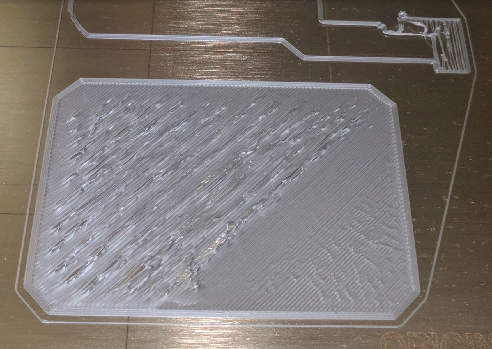
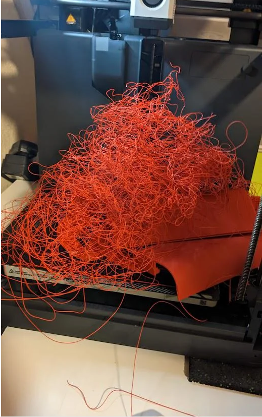
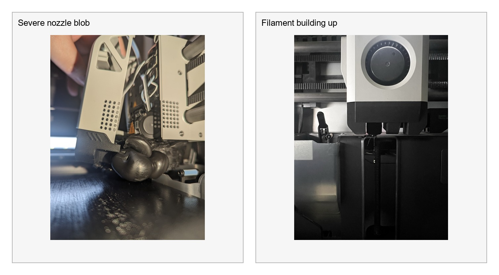
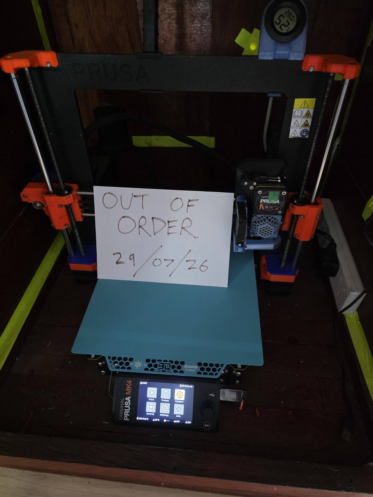

# Basic Troubleshooting

This page covers checks inducted members may perform without dismantling or adjusting a printer.

## Print does not stick

Stop the print. Remove and clean the build plate, dry it completely, refit it correctly and confirm that the slicer used the right printer, plate and material profiles.

<figure markdown="1">
  
  <figcaption>A poor first layer should be stopped and investigated before trying again.</figcaption>
</figure>

## Print lifts or spaghetti forms

Stop the print. Do not push a moving print back onto the plate. If plastic has collected around the nozzle or print head, stop using the printer and ask for help.

<figure markdown="1">
  
  <figcaption>Spaghetti failures should be stopped promptly.</figcaption>
</figure>

<figure markdown="1">
  
  <figcaption>If filament builds up around the nozzle or print head, stop and ask for help.</figcaption>
</figure>

## Filament does not load

Do not force it. Confirm the spool rotates, the filament end is cleanly cut and the correct load function is active. If it still fails, ask for help.

## AMS error

Confirm the spool rotates and no visible external obstruction exists. Do not pull filament or dismantle the AMS. Ask for help if the displayed procedure does not resolve it.

## Printer error or unusual noise

Pause or cancel the job, note or photograph the message and report the fault. Do not repeatedly restart a printer that continues to error.

<figure markdown="1">
  
  <figcaption>Do not use printers marked out of service.</figcaption>
</figure>

## Smoke, overheating or electrical damage

Stop the printer and isolate power if safe. Alert other members and follow the Hackspace emergency procedure.

## Report, do not repair

Members must not replace nozzles, adjust belts, open electrical enclosures, clear internal jams or alter hardware unless authorised.

Report faults or changed connection details by contacting the 3D printing team on Telegram, posting on the HacMan forum, or submitting a broken-tool report using one of the QR codes displayed around the Hackspace.
